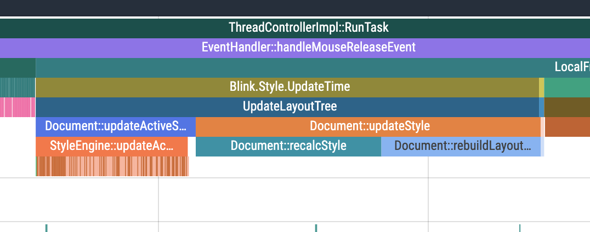

## Start it

#### Install dependencies

```shell
yarn install
```

#### Starting apps

```shell
# to start an app with @microsoft/fast-element
yarn dev:fast
# to start an app with plain Shadow DOM
yarn dev:shadow
# to start an app with real DOM
yarn dev:real
```

## Results

Use [Perfetto UI](https://ui.perfetto.dev/) to do measurements. Results show that layouting is still expensive because of classes matching process.

### Atomic CSS

#### Shadow DOM (constructable stylesheets)

`Document::recalcStyle` takes 118ms 299us


#### Shadow DOM (style tag)

`Document::recalcStyle` takes 118ms 551us


#### Real DOM

`Document::recalcStyle` takes 80ms 27us


### Monolithic CSS

`Document::recalcStyle` is 22ms 462us


